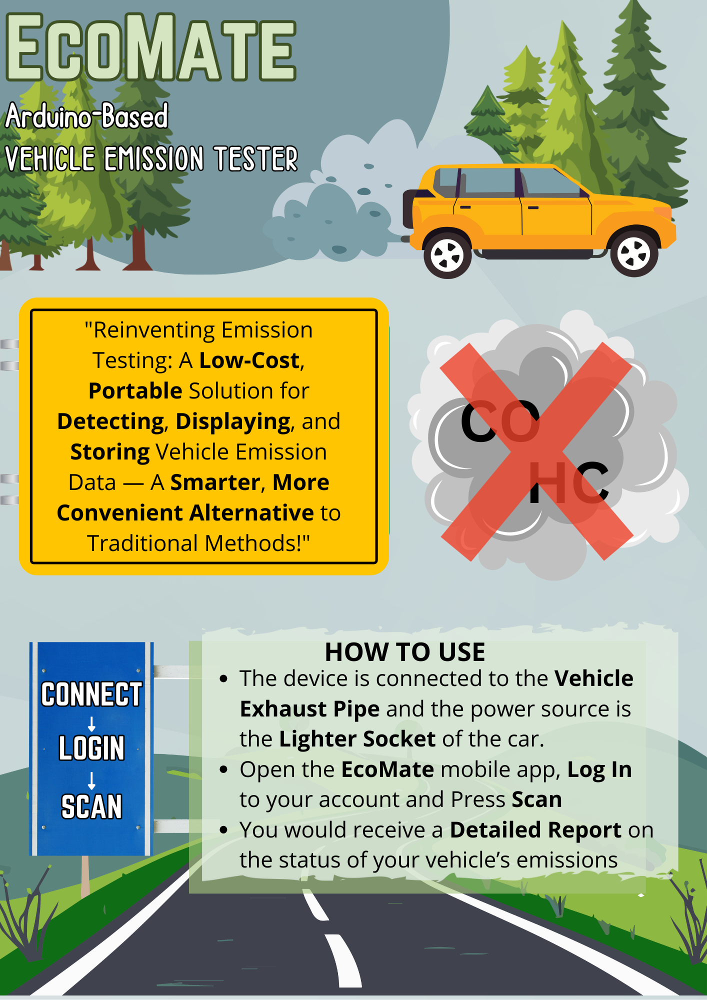
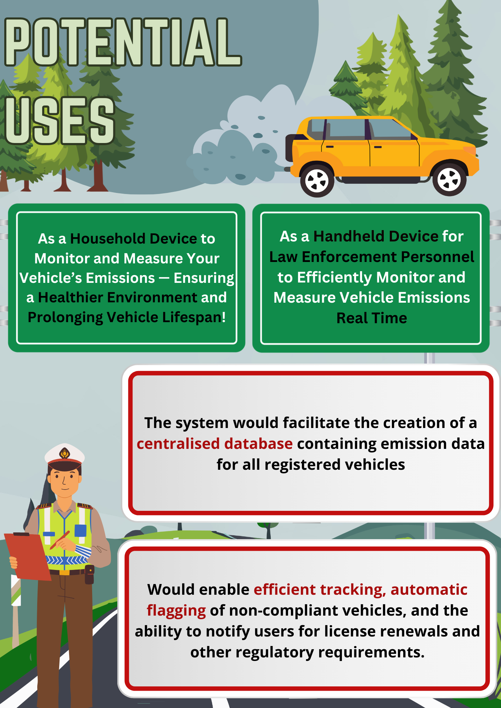
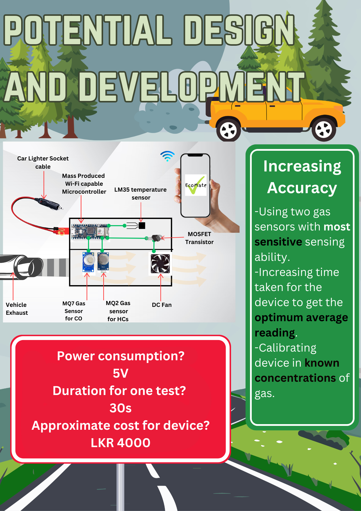

# Ecomate 🌿

A handheld, Arduino-based IoT vehicle emission tester. It monitors CO and HC levels. Data is processed and transmitted to a mobile app built with Expo for real-time tracking using an ESP32 Wi-Fi module. Ecomate provides a portable solution for emission testing, promoting cleaner and safer environments and vehicle health.



## Features

- **Real-Time Monitoring**: Measures CO and HC levels using MQ9 and MQ2 sensors.
- **Temperature Tracking**: Uses the LM35 sensor to monitor temperature changes.
- **Wireless Communication**: Uses an ESP32 Wi-Fi module to transmit data to the mobile app.
- **Mobile App Integration**: Data is displayed in an Expo-based mobile app for real-time monitoring.
- **Portable Design**: Compact and easy-to-use device, ideal for on-the-go emission testing.

## How to Use



- **Connect**: Attach the device to the vehicle's exhaust pipe and power it through the car's lighter socket.
- **Login & Scan**: Open the EcoMate mobile app, log in to your account, and press the scan button.
- **Receive Report**: Get a detailed report on your vehicle’s emission status directly on your mobile app.

## Potential Uses

- **Household Device**: Monitor and measure vehicle emissions at home, ensuring a healthier environment and prolonging vehicle lifespan.
- **Law Enforcement**: A tool for officers to monitor vehicle emissions in real-time.


## Hardware Components

- Arduino Board (e.g., Arduino Uno)
- ESP32 Wi-Fi Module
- MQ9 Sensor (CO detection)
- MQ2 Sensor (HC detection)
- LM35 Sensor (Temperature measurement)
- Breadboard, Wires, and Resistors

## Design and Development



- **Power Consumption**: 5V
- **Test Duration**: 30 seconds per test
- **Cost**: Approximately LKR 4000
- **Increasing Accuracy**: Using two gas sensors with high sensitivity, extended sampling time for better average readings, and calibration in known gas concentrations.

## Software Requirements

- Arduino IDE
- Expo CLI (for mobile app development)
- Node.js (for Expo setup)
- Expo Go (for testing the mobile app)
- Mobile device (for Expo app testing)

## Installation

### Arduino Setup

1. **Connect the Sensors**: Follow the wiring diagram to connect MQ9, MQ2, LM35 sensors, and ESP32 module to the Arduino board.
2. **Upload Code**: Use the Arduino IDE to upload the `ecomate.ino` file to the Arduino board.
3. **Verify Connections**: Ensure all sensors and the ESP32 module are properly connected and the Arduino board is powered on.

### Mobile App Setup

1. **Clone the Repository**:
   ```bash
   git clone https://github.com/username/ecomate.git
   cd ecomate/mobile-app
